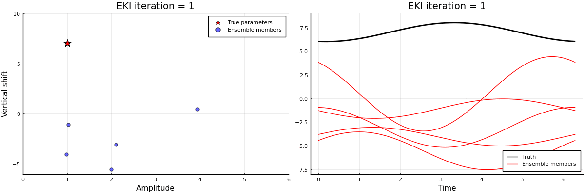

# EnsembleKalmanProcesses

`EnsembleKalmanProcesses.jl` (EKP) is a library of derivative-free Bayesian optimization techniques based on ensemble Kalman Filters, a well known family of approximate filters used for data assimilation. The tools in this library enable fitting parameters found in expensive black-box computer codes without the need for adjoints or derivatives. This property makes them particularly useful when calibrating non-deterministic models, or when the training data are noisy.

Currently, the following methods are implemented in the library:
 - Ensemble Kalman Inversion (EKI) - The traditional optimization technique based on the Ensemble Kalman Filter EnKF ([Iglesias, Law, Stuart, 2013](http://dx.doi.org/10.1088/0266-5611/29/4/045001)),
 - Ensemble Kalman Sampler (EKS) - also obtains a Gaussian Approximation of the posterior distribution, through a Monte Carlo integration ([Garbuno-Inigo, Hoffmann, Li, Stuart, 2020](https://doi.org/10.1137/19M1251655)),
 - Unscented Kalman Inversion (UKI) - also obtains a Gaussian Approximation of the posterior distribution, through a quadrature based integration approach ([Huang, Schneider, Stuart, 2022](https://doi.org/10.1016/j.jcp.2022.111262)),
- Sparsity-inducing Ensemble Kalman Inversion (SEKI) - Additionally adds approximate ``L^0`` and ``L^1`` penalization to the EKI ([Schneider, Stuart, Wu, 2020](https://doi.org/10.48550/arXiv.2007.06175)).

Module                                      | Purpose
--------------------------------------------|--------------------------------------------------------
EnsembleKalmanProcesses.jl                  | Collection of all tools
EnsembleKalmanProcess.jl                    | Implementations of EKI, EKS, UKI, and SEKI 
Observations.jl                             | Structure to hold observational data
ParameterDistributions.jl                   | Structures to hold prior and posterior distributions
DataContainers.jl                           | Structure to hold model parameters and outputs
Localizers.jl                               | Covariance localization kernels

## Learning the amplitude and vertical shift of a sine curve

[See full example for the code.](literated/sinusoid_example.md)

## Authors

`EnsembleKalmanProcesses.jl` is being developed by the [Climate Modeling
Alliance](https://clima.caltech.edu). The main developers are Oliver R. A. Dunbar and Ignacio Lopez-Gomez.

